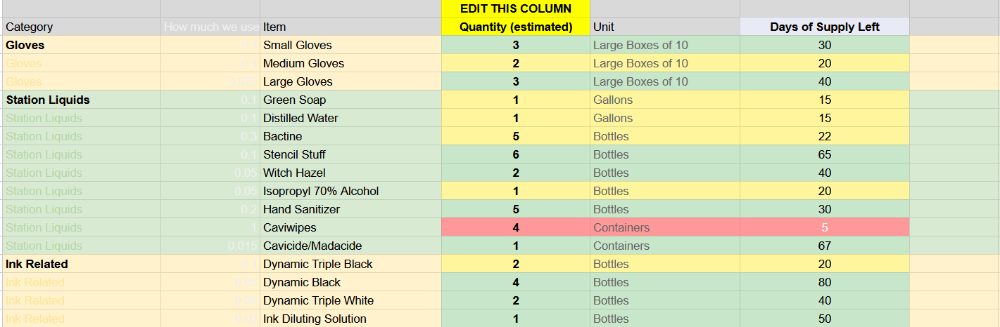

# Fleapit Inventory Management

> _Above: Example of the inventory spreadsheet with color-coded stock levels._

---

## Overview

This project is a **Google Apps Script** solution for managing inventory in a Google Sheet. It automates inventory tracking, color-codes stock levels, sends low-stock email alerts, and provides weekly and daily inventory updates. This script is used in production at https://www.instagram.com/fleapit___/. If you'd like to make a copy of it, an exmaple sheet is available at https://docs.google.com/spreadsheets/d/1-nnX35NG2T8KVAsjHdtOUbf2Zu6ycJ-tlHJaR4DO2YA/edit?usp=sharing.

---

## Features

- **Automatic Days of Supply Calculation:**  
  Calculates how many days of supply are left for each item based on current quantity and estimated daily usage.

- **Color-Coded Inventory:**  
  - **Red:** 10 days or less of supply (urgent restock needed)
  - **Yellow:** 11–29 days of supply (monitor soon)
  - **Green:** 30+ days of supply (sufficient stock)

- **Editable Quantity Column:**  
  Users can update the "Quantity (estimated)" column directly in the sheet. The script recalculates and updates all dependent fields and colors.

- **Low Stock Email Alerts:**  
  Automatically sends email notifications to designated recipients when any item falls below 10 days of supply.

- **Weekly Inventory Report:**  
  Sends a summary email every week, listing all low-stock items and providing a snapshot of inventory health.

- **Daily Inventory Update (Optional):**  
  Can be scheduled to decrement quantities based on daily usage, simulating real-world consumption.

- **Sorted Inventory Sheet:**  
  Automatically generates a second sheet with all items sorted by days of supply left, making it easy to see which items need attention first.

---

## How It Works

1. **Edit Quantities:**  
   Update the "Quantity (estimated)" column in the main sheet as items are used or restocked.

2. **Automatic Calculations:**  
   The script recalculates "Days of Supply Left" and updates color coding for each item.

3. **Email Alerts:**  
   If any item drops to 10 days or less, an email alert is sent to the specified recipients.

4. **Weekly & Daily Triggers:**  
   - **Weekly:** Sends a summary report every week.
   - **Daily (optional):** Decrements quantities by daily usage.

5. **Sorted Sheet:**  
   A secondary sheet ("Sheet2") is kept up-to-date and sorted by urgency.

---

## Setup Instructions

1. **Copy the Code:**  
   Paste the contents of `Code.gs` into the Google Apps Script editor attached to your Google Sheet.

2. **Set Up Triggers:**  
   - **On Edit:**  
     - Go to Triggers → Add Trigger  
     - Function: `onEdit`  
     - Event: "From spreadsheet" → "On edit"
   - **Weekly Report:**  
     - Function: `weeklyInventoryCheck`  
     - Event: "Time-driven" → "Week timer" (choose your preferred day/time)
   - **Daily Update (optional):**  
     - Function: `dailyInventoryUpdate`  
     - Event: "Time-driven" → "Day timer"

3. **Authorize the Script:**  
   The first time you run the script, you'll be prompted to grant permissions for sending emails and accessing your spreadsheet.

4. **Configure Recipients:**  
   Update the `recipients` arrays in the script with the email addresses that should receive alerts.

---

## Customization

- **Change Alert Thresholds:**  
  Edit the script to adjust the number of days for red/yellow/green levels.
- **Add/Remove Recipients:**  
  Update the `recipients` array in the script.
- **Modify Columns:**  
  If you change the sheet layout, update the column indices in the script accordingly.

---

## License

MIT License

---

**Questions?**  
Open an issue or contact the project maintainer.

---

